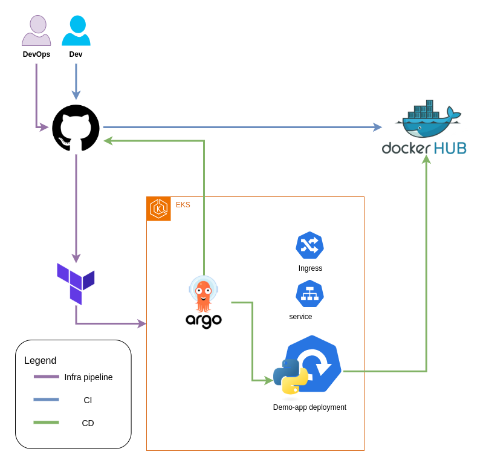
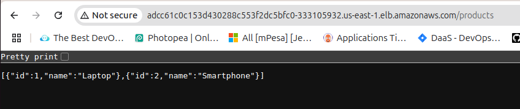
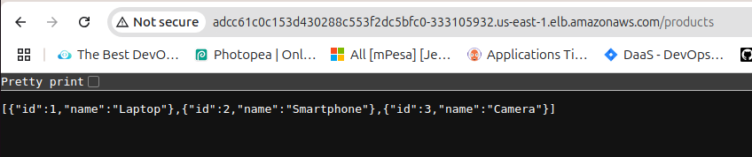

# Demo App DevOps

This repository contains a demo application with a complete DevOps setup, including Docker containerization, Kubernetes deployment, and infrastructure as code using Terraform.

## Application Screenshots

### Architecture Overview

The architecture diagram above illustrates the complete DevOps setup of our application, including the CI/CD pipeline, containerization, and Kubernetes deployment components.

### Application Access and Output

This screenshot demonstrates how to access the application using the NGINX Ingress Controller's LoadBalancer DNS. The application is accessible through a public endpoint, which routes traffic to the appropriate Kubernetes service.


The application output screenshot shows the successful deployment and response from our demo application after making changes. This confirms that our CI/CD pipeline is working correctly, with changes being automatically built, deployed, and verified.

## Project Structure

```
.
├── Microservices/          # Application source code
├── k8s-yaml/              # Kubernetes manifests
│   ├── argocd/           # ArgoCD configurations
│   │   └── application.yaml # Demo app ArgoCD application
│   └── demo-app/         # Application manifests
├── terraform/             # Terraform infrastructure code
│   ├── modules/          # Reusable Terraform modules
│   │   └── eks/         # EKS cluster module
│   └── environments/     # Environment-specific configurations
│       └── dev/         # Development environment
└── .github/
    └── workflows/        # GitHub Actions workflows
        ├── ci-docker-build-push.yml  # Docker build and push workflow
        └── terraform.yml         # Terraform workflow
```

## CI/CD Pipeline

### Docker Build and Push Pipeline

The Docker build pipeline (`ci-docker-build-push.yml`) is triggered on:
- Push to main branch
- Changes in the `Microservices/` directory

The pipeline:
1. Builds the Docker image
2. Tags it with both `latest` and the commit short hash
3. Pushes to DockerHub
4. Updates the Kubernetes deployment file with the new image tag
### CD: argocd app
watch changes to k8s-yaml/demo-app and apply if change done.
### Terraform Pipeline

The Terraform pipeline (`terraform.yml`) is triggered on:
- Push to main branch
- Pull requests to main branch
- Changes in the `terraform/` directory

The pipeline:
1. Formats and validates Terraform code
2. Plans changes on pull requests
3. Applies changes on main branch pushes

## Prerequisites

1. DockerHub account with:
   - `DOCKERHUB_USERNAME` secret
   - `DOCKERHUB_TOKEN` secret

2. AWS account with:
   - `AWS_ACCESS_KEY_ID` secret
   - `AWS_SECRET_ACCESS_KEY` secret

3. GitHub repository with:
   - Actions permissions enabled
   - Repository secrets configured

## Getting Started

1. Clone the repository:
   ```bash
   git clone https://github.com/Ahmed-Nasr-hassan/demo-app-devops.git
   cd demo-app-devops
   ```

2. Set up required secrets in GitHub repository settings:
   - `DOCKERHUB_USERNAME`
   - `DOCKERHUB_TOKEN`
   - `AWS_ACCESS_KEY_ID`
   - `AWS_SECRET_ACCESS_KEY`

3. Make changes to the application code in `Microservices/`
   for Dockerfile and image build and run details check `Microservices/README.md`

## Infrastructure

The infrastructure is managed using Terraform and includes:
- EKS cluster
- VPC with public and private subnets
- Node groups for worker nodes
- IAM roles and policies

See the `terraform/README.md` for detailed infrastructure documentation.

## Kubernetes Deployment

The application is deployed to Kubernetes using:
- ArgoCD for GitOps
- NGINX Ingress Controller
- LoadBalancer service

See the `k8s-yaml/README.md` for detailed deployment instructions.
